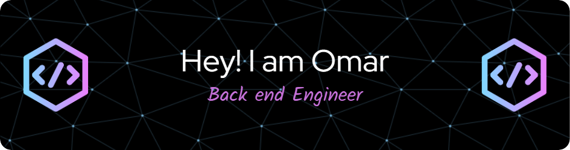

Hey there 👋

I'm a software engineer who specializes in Back end Development. I create beautifully-simple, innovative.

Want to know more about me? [Check out my linkedin.](https://www.linkedin.com/in/omar-abadi-91123a239/)

## 📝 Latest Blog Posts

 

<!-- BLOG-POST-LIST:START -->

<!-- BLOG-POST-LIST:END -->

 

## 📌 Pinned Repositories

 

 

 
 

## &#x1f4c8; GitHub Stats

 

 
 

## 💼 Skills

 
