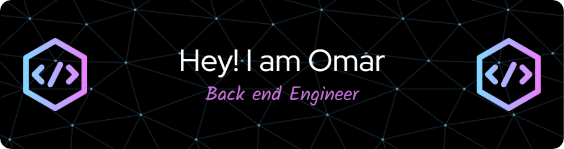

---

Hey there 👋 I'm **Omar Abadi** — a passionate software engineer from Egypt 🇪🇬 who loves building scalable, impactful back-end systems and exploring the intersection of AI and software engineering.

I craft clean APIs, design solid architectures, and enjoy turning complex problems into elegant solutions. Whether it's an ASP.NET microservice, a RAG-powered AI pipeline, or a full-stack freelancing platform — I'm always shipping.

---

## 🙋‍♂️ About Me

- 🎓 Computer Science graduate — built a **Multi-Model RAG Application** as my graduation project
- 💼 Back-end focused engineer with experience in **.NET, Python (FastAPI), and Node.js**
- 🤖 Interested in **AI/ML integration**, LLMs, and building production-ready intelligent systems
- 🧠 Consistent competitive programmer on [Codeforces](https://codeforces.com/profile/3mar_Ismail)
- 🌱 Currently deepening knowledge in **system design**, **design patterns**, and **distributed systems**
- ⚡ Fun fact: I enjoy building SaaS products and automating things that slow people down

---

## 🚀 What I'm Currently Building

- 🤖 **[AI WhatsApp Agent SaaS](https://github.com/omar344/ai-whatsapp-agent-saas)** — An ASP.NET-based SaaS platform that brings AI-powered agents to WhatsApp
- 📚 **[Multi-Model RAG App](https://github.com/omar344/multi-model-rag-app)** — A FastAPI application supporting multiple LLM providers (OpenAI, Groq, Voyage AI) with RAG capabilities
- 🔧 **[Design Patterns in C#](https://github.com/omar344/Design-Patterns)** — A hands-on reference implementation of classic design patterns

---

## 📌 Featured Projects

 

### 🤖 AI & Machine Learning

 
 

### 🌐 Full-Stack & Back-End Apps

 
 

### 📊 Data & Engineering

 
 

## &#x1f4c8; GitHub Stats

 

 

 
 

## 💼 Skills

**Languages & Frameworks**

**AI / Machine Learning**

**Data & Databases**

**Tools & Practices**

 

---

## 🤝 Let's Connect

I'm always open to interesting conversations, collaborations, and new opportunities.

 
