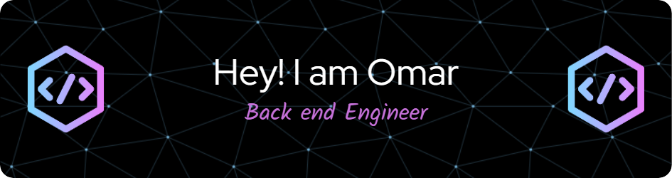

  

  

 

---

Hey there 👋 I'm **Omar Abadi** — a passionate **Back-end Software Engineer** from Egypt 🇪🇬 specializing in building highly scalable systems and intelligent AI integrations.

I architect robust APIs, design resilient cloud-ready infrastructures, and thrive on transforming complex business requirements into elegant, production-ready solutions. Whether I'm engineering a multi-model RAG pipeline or architecting a complete full-stack platform, my focus is always on writing clean code and shipping real value. 🚀

---

## 🙋‍♂️ About Me

- 🎓 **Computer Science Graduate**: Graduated with a capstone project focused on building a scalable **Multi-Model RAG Application**.
- 💼 **Back-end Architect**: Extensive experience crafting fast, secure, and resilient backend services using **.NET (C#)** and **Python (FastAPI)**.
- 🤖 **AI Integration Specialist**: Deeply passionate about integrating **LLMs**, Vector Databases, and machine learning pipelines into production web applications.
- 🧠 **Algorithms & Problem Solving**: Active competitive programmer conquering complex algorithms on [Codeforces](https://codeforces.com/profile/3mar_Ismail).
- 🌱 **Continuous Learner**: Currently mastering advanced **System Architecture**, distributed systems, and modern **Design Patterns**.
- ⚡ **Fun Fact**: I have a knack for identifying bottlenecks—I build SaaS tools specifically to automate and eliminate repetitive work!

---

##  What I'm Currently Building

- **[AI WhatsApp Agent SaaS](https://github.com/omar344/ai-whatsapp-agent-saas)** — A robust multi-tenant ASP.NET Core platform injecting conversational AI agents directly into WhatsApp to automate and scale customer interactions.
- **[Multi-Model RAG App](https://github.com/omar344/multi-model-rag-app)** — A high-performance FastAPI back-end that abstracts and unifies multiple LLM providers (OpenAI, Groq, Voyage AI) with advanced Retrieval-Augmented Generation capabilities.
- **[Design Patterns in C#](https://github.com/omar344/Design-Patterns)** — A comprehensive code repository demonstrating practical, enterprise-grade implementations of the classic GoF design patterns in modern C#.

---

## Featured Projects

 

 
 

## &#x1f4c8; GitHub Stats

 

 

 
 

## 💼 Skills

**Languages & Frameworks**

**AI / Machine Learning**

**Data & Databases**

**Tools & Practices**

 

---

## Let's Connect

I'm always open to interesting conversations, collaborations, and new opportunities.

 

---

## 🐍 Contribution Graph

  <picture>
    <source media="(prefers-color-scheme: dark)" srcset="https://raw.githubusercontent.com/omar344/omar344/output/github-contribution-grid-snake-dark.svg">
    <source media="(prefers-color-scheme: light)" srcset="https://raw.githubusercontent.com/omar344/omar344/output/github-contribution-grid-snake.svg">
    
  </picture>

 
